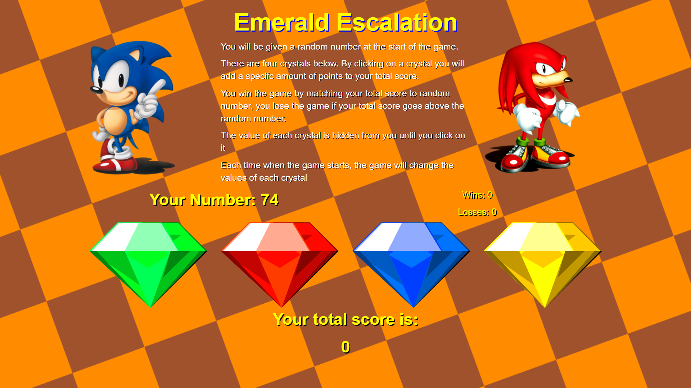

# Emerald Escalation

A Sonic-themed number game, made with bootstrap and jQuery. 

## Motivation

jQuery is one of the lighter frameworks that exists for Javascript. It can accomplish the same things that javescript does, but with fewer lines of code. Though there is a debate to be had about whether or not jQuery, in today's digital landscape, is still as useful as it once was, it still has its uses, in particular with older Internet Explorer versions, Ajax requests, or even large client-side applications.

Bootstrap is also a frameworks, comprised of HTML, CSS and javascript. It can help expedite the creation of a website or application by providing pre-built blocks of code that can easily be called upon, as opposed to creating everything from the ground up. Additionally, it is quite responsive for different devcies and web browsers, highly customizable, is constantly being updated and supported to maintain high standard of integrity.

## Links

To play the game immediately: https://github.com/VirtualVasquez/week-4-game

## Technologies Used

* HTML
* CSS
* Bootstrap
* Javascript
* jQuery

